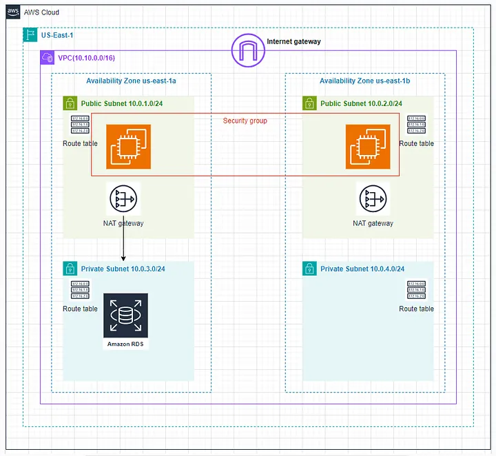

# 🏗️ Two-Tier Architecture on AWS

This project demonstrates a **Two-Tier Architecture** setup on AWS, featuring a web server tier and a database tier within a single VPC across multiple subnets.



## Architecture Description

- **VPC (10.10.0.0/16)** spanning two Availability Zones (us-east-1a and us-east-1b).
- **Public Subnets (10.0.1.0/24 & 10.0.2.0/24)** host EC2 web servers, each with its own route table and Security Group.
- **Internet Gateway** attached to the VPC to allow internet access for the web servers.
- **NAT Gateways** in each public subnet handle outbound traffic for resources in private subnets.
- **Private Subnets (10.0.3.0/24 & 10.0.4.0/24)** host Amazon RDS instances, isolated from direct internet access.
- **Security Groups** restrict inbound and outbound traffic between the web tier and the database tier.

## Technologies Used

- AWS VPC, Subnets, and Route Tables
- Internet Gateway & NAT Gateway
- AWS EC2 for Web Servers
- Amazon RDS for Database
- Security Groups for traffic control

## Project Structure

```
two-tier-architecture-aws/
├── app/                         # Sample app code
│   └── index.php                # Simple PHP page connecting to DB
├── scripts/
│   └── ec2-user-data.sh         # Bootstrap script to set up web server
├── images/
│   └── architecture.webp        # Architecture diagram
├── README.md
```

## 🚀 Getting Started

1. **Set up the VPC** with two public and two private subnets.
2. **Deploy EC2 instances** in public subnets and configure the web server.
3. **Create NAT Gateways** in public subnets for outbound internet access.
4. **Launch Amazon RDS** in private subnets for the database tier.
5. **Configure Security Groups** to allow web traffic (HTTP/HTTPS) to EC2 and database traffic (MySQL/PostgreSQL) from EC2 to RDS.

## 🔒 Security Considerations

- Web servers are publicly accessible, but the database is only reachable from within the VPC.
- Only necessary ports are opened in Security Groups (e.g., 80/443 for web, 3306/5432 for DB).
- NAT Gateways manage outbound traffic, keeping private resources secure.

## 📄 License

This project is licensed under the MIT License.